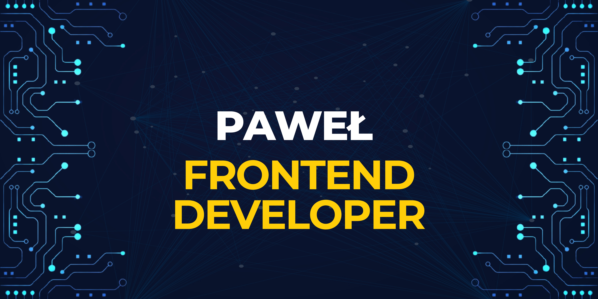

# Hi there! I’m Paweł, frontend developer fascinated in entrepreneurship and supporting local businesses. 👋

I'm currently working as a frontend developer in Polish digital agency/software house.

## My Gallup talents:
- Focus 🎯
- Learner 📖
- Input 📊
- Significance 🤝
- Achiever 🏆

## My Tech Stack:
 
 

 
 

 	

## My freelance websites:
Landscape architecture studio - [Strzelecka Studio](https://strzeleckastudio.pl/)

## Connect with me:

## Side project: iSave - Budget App connected with OCR and AI to generate data from receipts 

iSave - [Link to an application](https://isave-ten.vercel.app)
The tech stack is described [here](https://github.com/Pawel-Gnat/isave)
I try to improve this app whenever I have free time.
Only Polish version of an app is provided, because my family uses it, which is a priority for me.
